# 🤖 AI CLI Chatbot

A production-grade multi-mode AI chatbot with intelligent model routing, conversation memory management, versioned prompts, and detailed cost tracking — built with Python and OpenAI-compatible APIs.


## Features

### Core Features
- **5 Expert Modes** — Switch between General Assistant, Ruby/Rails Expert, Python Tutor, SQL Expert, and Code Reviewer
- **Conversation Memory** — Full conversation history maintained across turns with smart filtering
- **Save & Load** — Persist conversations to JSON files and resume later
- **History Management** — Empty responses filtered automatically to keep conversation quality high
- **Graceful Error Handling** — Rate limits, timeouts, and API failures handled without crashing

### Production-Grade Features (Week 2 Enhancements)
- **Intelligent Model Routing** — Automatically picks the optimal model for each question type (fast for simple, reasoning for complex)
- **Sliding Window Memory** — Caps conversation token cost without losing recent context
- **Detailed Cost Tracking** — Separates input/output tokens, tracks cost per call and per model
- **Versioned Prompt Registry** — Track prompt changes like database migrations, roll back if a new version performs worse

## Demo

```
$ python main.py

=======================================================
  🤖  AI CLI Chatbot
  Built by Pragya Sriharsh
=======================================================

  Mode: General Assistant
  Type /help for commands

You: /explain why is my Rails app slow?
  Would use: Nemotron (reasoning)
  Reason:    Detected reasoning/analysis question — using reasoning model

You: /mode sql
  Switched to: SQL Expert

You: write a query for finding top customers

AI [Nemotron (balanced)]:
WITH customer_totals AS (
    SELECT customer_id, SUM(order_total) AS total_revenue
    FROM orders
    GROUP BY customer_id
)
SELECT c.name, ct.total_revenue
FROM customer_totals ct
JOIN customers c ON c.id = ct.customer_id
ORDER BY ct.total_revenue DESC
LIMIT 10;
   [580 tok | in:120 out:460 | $0.000087 | stop]

You: /stats

  === Session Stats ===
  Mode:           SQL Expert (v1.0)
  Window:         10 turns
  Total calls:    1
  Input tokens:   120
  Output tokens:  460
  Total tokens:   580
  Avg per call:   580
  Total cost:     $0.000087
```

## Architecture

<p align="center">
  
</p>

The flow shows:
User input → Command router (detects / commands vs regular messages) → branches into command handlers (mode, stats, save, load, reset, history, window, routing, versions, rollback) or chat engine (ChatSession class) → router selects optimal model → calls OpenRouter API → cost tracker logs every call → returns response with stats (content, tokens, cost, finish reason). Save/load commands connect to JSON storage. Prompt registry manages versioned system prompts with rollback capability.

```
main.py              → Chat loop, command router, session orchestration
modes.py             → Mode display names and routing config
router.py            → Intelligent model selection per question (NEW Week 2)
prompt_registry.py   → Versioned prompts with rollback (NEW Week 2)
cost_tracker.py      → Token + cost tracking, in/out separation (NEW Week 2)
storage.py           → JSON-based conversation persistence
chat_history/        → Saved conversation files (gitignored)
```


## Available Modes

| Mode | Command | Description |
|------|---------|-------------|
| General Assistant | `/mode general` | General-purpose AI assistant |
| Ruby/Rails Expert | `/mode ruby` | Explains concepts using Ruby/Rails analogies |
| Python Tutor | `/mode python` | Teaches Python with Ruby comparisons side by side |
| SQL Expert | `/mode sql` | Writes and optimizes PostgreSQL queries with index suggestions |
| Code Reviewer | `/mode code-review` | Reviews code for bugs, performance, style, and security |

## All Commands

### Basic Commands
| Command | Description |
|---------|-------------|
| `/mode <name>` | Switch to a different expert mode |
| `/modes` | List all available modes |
| `/save [name]` | Save conversation to a JSON file |
| `/load <name>` | Load a previously saved conversation |
| `/history` | List all saved conversations |
| `/reset` | Clear conversation history and cost tracking |
| `/help` | Show all available commands |
| `/quit` | Exit the chatbot |

### Production Feature Commands (Week 2)
| Command | Description |
|---------|-------------|
| `/stats` | Detailed session stats: tokens (in/out), cost, per-model breakdown |
| `/window <n>` | Set sliding window size (or `off` for unlimited history) |
| `/routing on/off` | Toggle automatic model selection per question |
| `/explain <q>` | Show which model would handle a question (without asking it) |
| `/versions <mode>` | Show version history of a mode's prompt |
| `/rollback <mode> <v>` | Roll back to an older prompt version |

## Setup

```bash
# Clone the repo
git clone https://github.com/sriharshpragya/ai-cli-chatbot.git
cd ai-cli-chatbot

# Create virtual environment
python3.11 -m venv venv
source venv/bin/activate

# Install dependencies
pip install openai python-dotenv

# Add your API key (get one free at openrouter.ai)
cat > .env << 'EOF'
OPENROUTER_API_KEY=your-key-here
EOF

# Run
python main.py
```

## Tech Stack

- **Python 3.11** — Core language
- **OpenAI SDK** — LLM API client (OpenAI-compatible format)
- **OpenRouter** — Multi-model gateway (access GPT, Claude, DeepSeek, Gemma, and more via one API)
- **python-dotenv** — Secure API key management
- **JSON** — Lightweight conversation and prompt persistence

## Key Design Decisions

**Why OpenRouter?** — Single API format works with 100+ models. Switch models by changing one string. No vendor lock-in. Critical for the model routing feature.

**Why filter empty responses?** — Empty/None assistant responses in conversation history degrade future answer quality. The model sees failed turns and its responses get worse. Smart filtering keeps history clean.

**Why intelligent model routing?** — Different questions need different model capabilities. Simple factual questions don't need a reasoning model — that's wasted tokens. The router classifies each question and picks the optimal model. In production this saves 50-80% on token costs.

**Why sliding window memory?** — LLMs have no memory between API calls; you send the entire conversation history with each call. Without limits, token cost grows quadratically. Sliding window caps history at N recent turns, keeping costs bounded while preserving recent context.

**Why separate input/output token tracking?** — Output tokens cost 3-4x more than input tokens on most models (GPT-4o: $2.50 input / $10 output per 1M). Tracking them separately reveals where optimization matters most.

**Why versioned prompts?** — Prompts are like database schemas — small changes can break production. The registry tracks every version with notes explaining each iteration. If a new prompt performs worse, `/rollback` switches back without a code deploy.

**Why system prompts for modes?** — System prompts are the simplest and most powerful way to shape AI behavior. No fine-tuning needed — just clear instructions. Each mode demonstrates how the same model produces vastly different outputs based on the system prompt.

## What I Learned Building This

### Week 1 — Foundations
- LLM APIs use a messages array format — the model has no memory, you manage conversation history
- System prompts are powerful enough to create distinct expert personas without fine-tuning
- Token costs grow with every conversation turn (entire history is re-sent each time)
- Always check for None content — API success (HTTP 200) doesn't guarantee useful output
- The `.get()` method returns None (not the default) when a key exists with a null value
- Free models have rate limits and inconsistent availability — fallback models are essential
- Exponential backoff prevents thundering herd problems when retrying failed requests

### Week 2 — Production Patterns
- Output tokens cost 3-4x more than input tokens on most models
- Prompt compression alone isn't enough — must constrain output length too
- Different question types need different models (intelligent routing pattern)
- Sliding window is essential for chat apps at scale
- Versioned prompts enable safe iteration and rollback in production
- Persona drift is real — strong format rules and explicit constraints prevent it
- A/B testing prompts requires measurable metrics (cost, quality, latency)
- Atomic commits per feature make code reviewable and rollbackable

## Author

**Pragya Sriharsh** — Senior Engineering Lead at Persistent Systems, transitioning into Agentic AI development. 10+ years of backend experience with Ruby/Rails, Node.js, PostgreSQL, and AWS.

This is Week 1-2 of a [26-week Agentic AI learning roadmap](https://github.com/sriharshpragya).

## License

MIT
